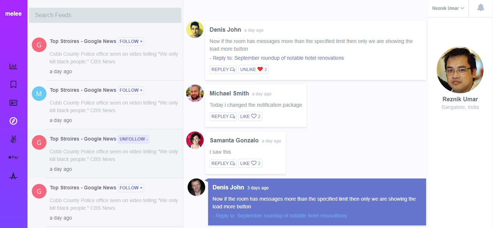

### Design To HTML
Sometimes I like to convert PSD, xd designs or images to HTML/CSS pages using Tailwind or Bootstrap frameworks for fun. This repository contains some of these implementations.

### Landro

### Melee

### Travel

